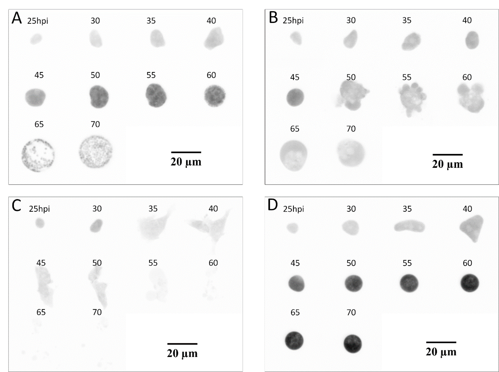
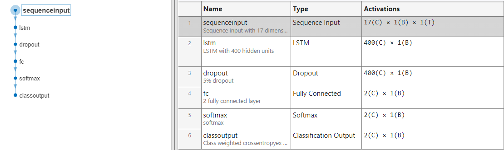
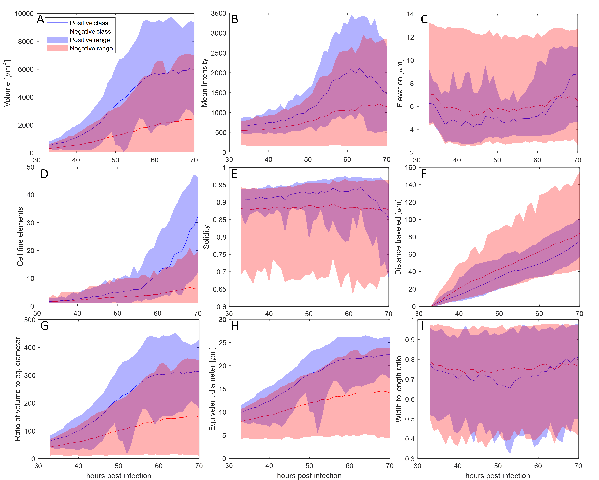

# ML Malaria prediction

This repository provides the implementation of our machine learning model for predicting Plasmodium liver stage development in vitro using microscopy imaging.

In our work, we delve into the liver stage development of the P. berghei parasite responsible for the Malaria virus and examine the host-parasite interactions using HeLa cells.  We aimed to use fluorescent microscopy images of in conjunction with artificial intelligence to predict the development of the parasite as opposed to classifying the images at the end of the development stage.

---

**Infected cells - Image data**

Blood stabilates of P. berghei constitutively expressing mCherry were used to infect mice. Upon sufficient sexual forms of the parasites (gametocytes), mice were anesthetized using Ketamin/Xylazine. Female Anopheles stephensi mosquitoes were allowed to feed on the anesthetized mice for 30 minutes. Mosquitoes were kept at 20.5◦C and > 80% relative humidity and fed daily with 8% fructose-containing 0.2% para-aminobenzoic acid. From day 18 to 26 post feeding salivary glands of infected mosquitoes were dissected and used for liver-stage infections. Sporozoites were released using a pellet pestle mixer. Around 20,000 Sporozoites released from salivary glands were used to infect confluent HeLa cells (40,000cells/96well in MEM10%FCS, PenStrep seeded the day before). Two hours post-infection the cells were detached with accutase (Innovative Cell Technologies) and reseeded onto 24 well-glass bottom well plates and incubated at 37◦C 5% CO2. Medium was replaced the next day (2ml).

3D image acquisitions of infected cells were acquired hourly, starting at around 24 hours post infection (hpi), using a fully automated Nikon CSU-W1 spinning disc (4000 rpm) confocal microscope set at 37◦C and 5% CO2 (Omicron Laser 561 nm, 100 ms exposures with 2x2 binning and 16-bit depth on Photometrics Prime BSI CMOS camera, Plan Apo λ 40× (NA 0.95) objective). 

Development of P. berghei parasites. A) Normal development and (B-D) defective development are shown as still images from time-lapse fluorescent microscopy for the indicated timepoints. In B) the parasite has lost its integrity at 50 hpi, in C) already at 35 hpi and in D) the parasite did develop normally till 45 hpi but then was not progressing.

--

**Overall architecture of the proposed neural network.**

Using an LSTM based architecture, our proposed model is illustrated below. 

---

**Developing and non-developing parasite features during development stage.**

Various parasite features tracked over time illustrating the parasite development: A) volume of parasite-infected cell, B) mean fluorescent signal intensity, C) infected cell elevation, D) number of bright elements inside a parasite-infected cell as proxy for merozoites, E) solidity - computed as ratio of volume to convex volume, F) distance traveled, G) ratio of volume to equivalent diameter, H) equivalent diameter, I) ratio of cell width to height}. Mean values are shown with a blue line (positive) and red line (negative). The shaded areas represent the range of the features and overlapping ranges are marked with dark red.

---

**Dependencies**

This code was tested using Matlab 2023b. It has the following toolbox dependencies:
- Statistics and Machine Learning Toolbox
- Deep learning Toolbox
- Computer Vision Toolbox

---

## Acknowledgments

This work was funded by the Swiss National Science Foundation under grant number CRSII5_198543.
